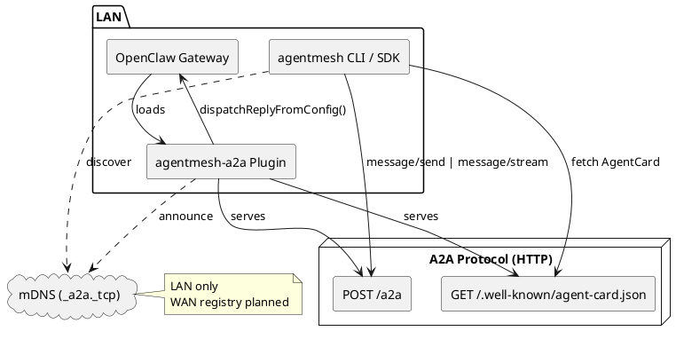
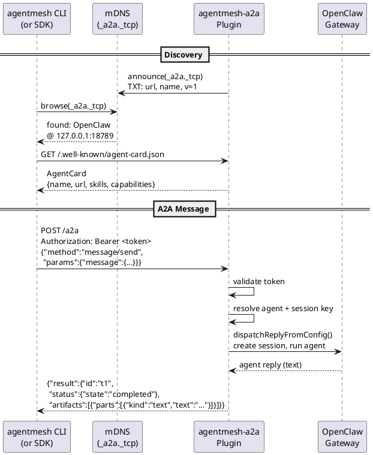

# AgentMesh

[English](./README.md) | [简体中文](./README.zh-CN.md)

Agent discovery mesh for A2A agents. Enables agents across frameworks (OpenClaw, NanoClaw, etc.) to discover each other via mDNS and communicate using the [A2A protocol](https://google.github.io/A2A/).

## Features

| Feature | Description | Package |
|---|---|---|
| mDNS discovery | Auto-discover agents on LAN via `_a2a._tcp` | `discovery-py` (Python), `openclaw-plugin` (TS) |
| Static discovery | Known endpoints via `bootstrap.json` | `discovery-py` (Python) |
| CLI toolchain | `discover`, `run`, `trace` — full agent interaction loop | `agentmesh-cli` (Python) |
| Control plane | Event storage (JSONL + SQLite), HTTP API, daemon management | `agentmeshd` (Python) |
| A2A bridge | AgentCard, `message/send`, `message/stream`, `tasks/get`, `tasks/cancel` | `openclaw-plugin` (TS) |
| SSE streaming | Real-time text, tool status, reasoning metadata | `openclaw-plugin` (TS) |
| Multi-agent routing | Route by `skill_id` to different agent identities | `openclaw-plugin` (TS) |
| Token auth | Auto-generated or explicit; CLI auto-detects from config | `openclaw-plugin` (TS), `agentmesh-cli` (Python) |
| Session strategies | `per-task`, `per-conversation`, `shared` | `openclaw-plugin` (TS) |
| A2A v0.3 aligned | `kind` discriminator, `context_id`, `message_id`, 9-state lifecycle | All |

**Not yet supported:** WAN / internet discovery (LAN only — no registry server yet)

## Quick Start

### Prerequisites

- [uv](https://docs.astral.sh/uv/) (Python package manager)
- [pnpm](https://pnpm.io/) (Node.js package manager)
- [OpenClaw](https://github.com/nichochar/openclaw) `>=2026.1.0 <2027.0.0`

### Install

```bash
cd agentmesh
make prepare          # Install all dependencies + CLI tools
```

This installs two CLI tools: `agentmeshd` (daemon) and `agentmesh` (client).

### Setup an OpenClaw Agent

Install the A2A bridge plugin into OpenClaw:

```bash
agentmesh openclaw install
```

Configure the plugin in `~/.openclaw/openclaw.json`:

```jsonc
{
  "plugins": {
    "entries": {
      // ... existing entries ...
      "agentmesh-a2a": {
        "enabled": true,
        "config": {
          "publicBaseUrl": "http://127.0.0.1:18789",
          "agentName": "OpenClaw",
          "auth": { "token": "your-secret-token" },
          "mdns": true,
          "session": { "strategy": "per-task" }
        }
      }
    }
  }
}
```

Start the OpenClaw gateway:

```bash
openclaw gateway
```

### Discover, Run, Trace

```bash
# 1. Start the daemon in background (records events for trace)
agentmeshd start -b

# 2. Discover agents on the local network
agentmesh discover

# 3. Send a message to an agent
agentmesh run --agent OpenClaw "What is 2+2?"

# 4. View the event trace
agentmesh trace <run-id>

# 5. Stop the daemon when done
agentmeshd stop
```

The CLI auto-detects auth tokens from OpenClaw config. To use a specific token:

```bash
agentmesh run --agent OpenClaw --token your-secret-token "Hello"
```

## CLI Reference

### `agentmesh discover`

Scan the local network for A2A agents via mDNS, optionally merging static bootstrap entries.

```bash
agentmesh discover                           # Default 5s timeout, table output
agentmesh discover --timeout 10              # Longer scan
agentmesh discover --bootstrap agents.json   # Include static entries
agentmesh discover --format json             # JSON output
```

Exit codes: `0` (agents found), `11` (no agents found).

### `agentmesh run`

Send a message to an A2A agent. Events are recorded to `agentmeshd` for later tracing.

```bash
# By agent name (resolved via mDNS)
agentmesh run --agent OpenClaw "Hello"

# By AgentCard URL
agentmesh run --agent http://127.0.0.1:18789/.well-known/agent-card.json "Hello"

# With explicit auth token
agentmesh run --agent OpenClaw --token my-secret "Hello"

# Skip daemon (no event recording)
agentmesh run --agent OpenClaw --no-daemon "Hello"
```

| Option | Description |
|---|---|
| `--agent` / `--to` | Agent name or AgentCard URL |
| `--from` | Sender identity (metadata only) |
| `--token` | Bearer token (also reads `AGENTMESH_TOKEN` env var) |
| `--timeout` | A2A call timeout in seconds (default: 120) |
| `--no-stream` | Disable streaming output |
| `--no-daemon` | Skip daemon check, no event recording |
| `--daemon-url` | Override agentmeshd URL |
| `--format` | `streaming` (default) or `json` |

Exit codes: `0` (success), `10` (daemon unavailable), `11` (agent not found), `12` (invoke failed).

### `agentmesh trace`

View the event timeline for a previous run. Requires `agentmeshd` to be running.

```bash
agentmesh trace <run-id>                     # Timeline output
agentmesh trace <task-id>                    # Also accepts task IDs
agentmesh trace <run-id> --format json       # JSON output
```

Example output:

```
Run: abc-123  Agent: OpenClaw  Started: 2026-02-19T10:00:00Z

10:00:00.000  message   "What is 2+2?"
10:00:00.120  status    working
10:00:01.100  status    completed
10:00:01.100  artifact  "4"

Duration: 1.1s  Events: 4
```

Exit codes: `0` (success), `1` (no events found), `10` (daemon unavailable).

### `agentmesh openclaw install`

Install the OpenClaw A2A bridge plugin. Requires the `openclaw` CLI.

```bash
agentmesh openclaw install           # Install plugin
agentmesh openclaw install --force   # Reinstall / update
```

## OpenClaw Plugin Configuration

| Field | Type | Default | Description |
|---|---|---|---|
| `publicBaseUrl` | string | **(required)** | Public URL for this agent (no trailing slash) |
| `agentName` | string | `"OpenClaw"` | Agent name in the A2A AgentCard |
| `agentDescription` | string | `"An OpenClaw agent exposed via A2A"` | Description in the AgentCard |
| `mdns` | boolean | `true` | Announce agent via mDNS (`_a2a._tcp`) |
| `auth.token` | string | auto-generated | Bearer token for the `/a2a` endpoint |
| `auth.allowUnauthenticated` | boolean | `false` | Disable auth entirely (not recommended) |
| `session.strategy` | string | `"per-task"` | `"per-task"`, `"per-conversation"`, or `"shared"` |
| `session.prefix` | string | `"a2a"` | Session key prefix |
| `session.agentId` | string | `"main"` | Which OpenClaw agent identity to use |
| `session.timeoutMs` | number | `120000` | Max wait time (per-task only) |
| `skills` | array | `[{id:"chat",...}]` | Skills listed in the AgentCard (single-agent) |
| `agents` | object | — | Multi-agent routing: map agent identities to skills |

To update the plugin after code changes:

```bash
make sync-plugin      # rsync src/ to extension dir
# Then restart: openclaw gateway
```

## Python SDK

The `agentmesh-discovery` package provides programmatic access to agent discovery:

```python
import asyncio
from agentmesh_discovery import MdnsDiscovery, DiscoveryManager

async def main():
    discovery = MdnsDiscovery()
    agent = await discovery.discover_one(timeout=5.0)

    card = await DiscoveryManager.fetch_agent_card(agent.agent_card_url)
    print(card.name, card.url)

asyncio.run(main())
```

**Discovery sources:**
- `MdnsDiscovery` — listens for `_a2a._tcp.local.` via zeroconf
- `StaticDiscovery` — reads from a `bootstrap.json` file
- `DiscoveryManager` — merges and deduplicates across sources
- `MdnsAnnouncer` — publish your own agent via mDNS

A full example (discover + invoke via `a2a-sdk`) is in `examples/py-agent/main.py`:

```bash
uv run python examples/py-agent/main.py "1+9"
```

## Architecture

### Component Overview



### Discovery + Invoke Flow



### Repository Structure

```
agentmesh/
├── packages/
│   ├── agentmesh-cli/          # CLI: discover, invoke, trace A2A agents
│   ├── agentmeshd/             # Control plane daemon: events, storage, HTTP API
│   ├── discovery-py/           # Python SDK: mDNS + static discovery
│   └── openclaw-plugin/        # OpenClaw extension: AgentCard + A2A bridge + mDNS
├── tests/e2e/                  # E2E smoke tests
├── examples/py-agent/          # SDK usage example
├── Makefile                    # Cross-language build commands
├── pyproject.toml              # Python monorepo root (uv)
└── package.json                # TS monorepo root (pnpm)
```

## Development

All commands run from the repo root:

```bash
make prepare       # Install all dependencies + CLI tools
make test          # Run all tests (TS + Python)
make check         # Lint + typecheck all
make format        # Format Python code
make release-check # Validate release version alignment (optionally with RELEASE_TAG=vX.Y.Z)
make build         # Build Python and npm release artifacts under dist/
make help          # Show all available targets
```

Per-package targets:

```bash
make test-openclaw-plugin    # TS plugin tests
make test-discovery-py       # Python SDK tests
make test-agentmeshd         # agentmeshd tests
make test-agentmesh-cli      # CLI unit tests
make test-e2e                # E2E smoke tests
```

### Low-level A2A Verification

```bash
# Fetch AgentCard (no auth)
curl http://localhost:18789/.well-known/agent-card.json

# Send a message (requires auth)
curl -X POST http://localhost:18789/a2a \
  -H 'Content-Type: application/json' \
  -H 'Authorization: Bearer your-secret-token' \
  -d '{"jsonrpc":"2.0","id":"1","method":"message/send","params":{"id":"t1","message":{"role":"user","parts":[{"kind":"text","text":"Hi"}]}}}'

# mDNS discovery (macOS)
dns-sd -B _a2a._tcp
```

## Known Limitations

- **Cancellation is best-effort**: OpenClaw has no abort API for `dispatchReplyFromConfig`. The A2A task is marked canceled but the internal agent dispatch may continue.
- **Non-text parts are text-converted**: File and data parts are converted to `[File: name]` and `[Data: json]` text representations.
- **Streaming granularity depends on OpenClaw**: If `deliver` is only called with `kind: "final"`, streaming degrades to a single SSE event.
- **LAN only**: No WAN/internet discovery yet.

## Roadmap

| Feature | Description |
|---|---|
| Web GUI | Topology visualization, event timeline, filtering |
| Agent Teams | FSM orchestrator, multi-agent coordination templates |
| WAN Discovery | Tailscale integration, registry server |

See [execution plan](docs/m1-m4_execution_plan.md) for details.
