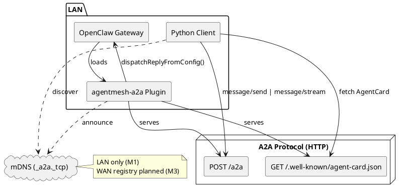
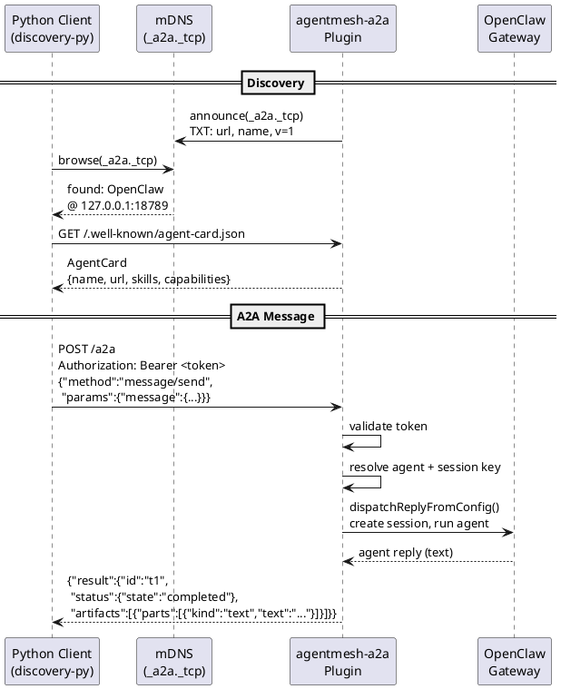

# AgentMesh

[English](./README.md) | [简体中文](./README.zh-CN.md)

Agent discovery mesh for A2A agents. Enables agents across frameworks (OpenClaw, NanoClaw, etc.) to discover each other via mDNS and communicate using the [A2A protocol](https://google.github.io/A2A/).

## Features (M2)

- **LAN agent discovery** via mDNS (`_a2a._tcp`) — agents on the same network find each other automatically
- **Static discovery** via `bootstrap.json` for known agent endpoints
- **A2A protocol bridge for OpenClaw** — serves AgentCard, handles `message/send`, `message/stream`, `tasks/get`, `tasks/cancel`
- **SSE streaming** — real-time responses via `message/stream` (text, tool status, reasoning metadata)
- **Multi-agent routing** — route A2A requests to different OpenClaw agent identities based on `skill_id`
- **Non-text message parts** — file and data parts accepted (converted to text representations for the agent)
- **Task cancellation** — abort in-flight tasks via `tasks/cancel`
- **Bearer token authentication** for the A2A endpoint (auto-generated or explicit)
- **Session strategies**: `per-task`, `per-conversation`, `shared`
- **Python discovery SDK** (`agentmesh-discovery`) using official `a2a-sdk` types
- **A2A spec v0.3 aligned** — `kind` discriminator, `context_id`, `message_id`, 9-state task lifecycle

**Not yet supported:**
- WAN / internet discovery (LAN only — no registry server yet)

## Architecture

### Component Overview



### Discovery + Task Flow



### Repository Structure

```
agentmesh/
├── packages/
│   ├── discovery-py/           # Python SDK — mDNS + static discovery
│   ├── openclaw-plugin/        # OpenClaw extension: AgentCard + A2A bridge + mDNS
│   ├── agentmeshd/             # Python — control plane daemon, EventV1, JSONL+SQLite
│   ├── agentmesh-cli/          # Python — CLI: discover, invoke, trace A2A agents
│   ├── discovery-ts/           # TS SDK (planned)
│   ├── registry/               # Registry server (planned)
│   └── identity/               # Ed25519 identity (planned)
├── tests/e2e/                  # E2E smoke tests (mock agent + in-process daemon)
├── examples/
│   ├── py-agent/               # Discover → A2A task → print result
│   └── demo.sh
├── .github/workflows/ci.yml    # GitHub Actions CI
├── Makefile                    # Cross-language build commands
├── package.json                # Monorepo root (pnpm for TS)
├── pnpm-workspace.yaml
├── pyproject.toml              # Monorepo root (uv for Python)
└── README.md
```

## Quick Start

### Prerequisites

- [uv](https://docs.astral.sh/uv/) (Python package manager)
- [pnpm](https://pnpm.io/) (Node.js package manager)
- [OpenClaw](https://github.com/nichochar/openclaw) `>=2026.1.0 <2027.0.0`

### Install

```bash
cd agentmesh
make prepare          # Install all dependencies (pnpm + uv)
```

### Install the OpenClaw Plugin

```bash
make install-plugin
```

The CLI registers the plugin with an empty config. Add your config to
`~/.openclaw/openclaw.json` under `plugins.entries.agentmesh-a2a`:

```jsonc
{
  "plugins": {
    "entries": {
      // ... existing entries ...
      "agentmesh-a2a": {
        "enabled": true,
        "config": {
          "publicBaseUrl": "http://127.0.0.1:18789",
          "agentName": "OpenClaw",
          "auth": {
            "token": "your-secret-token"
          },
          "mdns": true,
          "session": {
            "strategy": "per-task"
          }
        }
      }
    }
  }
}
```

Verify the plugin loads:

```bash
openclaw plugins list
# Should show: AgentMesh A2A Bridge │ agentmesh-a2a │ loaded
```

To update the plugin after code changes:

```bash
make sync-plugin
# Then restart: openclaw gateway
```

### Plugin Config Reference

| Field | Type | Default | Description |
|---|---|---|---|
| `publicBaseUrl` | string | **(required)** | Public URL for this agent (no trailing slash) |
| `agentName` | string | `"OpenClaw"` | Agent name in the A2A AgentCard |
| `agentDescription` | string | `"An OpenClaw agent exposed via A2A"` | Description in the AgentCard |
| `mdns` | boolean | `true` | Announce agent via mDNS (`_a2a._tcp`) |
| `auth.token` | string | auto-generated | Bearer token for the `/a2a` endpoint |
| `auth.allowUnauthenticated` | boolean | `false` | Disable auth entirely (not recommended) |
| `session.strategy` | string | `"per-task"` | `"per-task"`, `"per-conversation"`, or `"shared"` |
| `session.prefix` | string | `"a2a"` | Session key prefix |
| `session.agentId` | string | `"main"` | Which OpenClaw agent identity to use |
| `session.timeoutMs` | number | `120000` | Max wait time (per-task only) |
| `skills` | array | `[{id:"chat",...}]` | Skills listed in the AgentCard (single-agent) |
| `agents` | object | — | Multi-agent routing: map agent identities to skills |

### Run the Demo

```bash
# 1. Start OpenClaw gateway (plugin loads automatically)
openclaw gateway

# 2. Run the Python discovery demo (from agentmesh repo root)
AGENTMESH_TOKEN=your-secret-token uv run python examples/py-agent/main.py "What is 2+2?"
```

Example output:

```
Discovering A2A agents via mDNS...
Found agent: OpenClaw at http://127.0.0.1:18789/.well-known/agent-card.json
Fetching AgentCard from http://127.0.0.1:18789/.well-known/agent-card.json...
Agent: OpenClaw — An OpenClaw agent exposed via A2A
A2A endpoint: http://127.0.0.1:18789/a2a
Skills: Chat

Sending message: What is 2+2?
----------------------------------------
Status: completed

4
```

You can also skip mDNS discovery and target the agent directly:

```bash
AGENTMESH_TOKEN=your-secret-token uv run python examples/py-agent/main.py \
  --url http://127.0.0.1:18789/.well-known/agent-card.json "Hello!"
```

## CLI Usage

The `agentmesh` CLI provides a unified interface for discovering, invoking, and tracing A2A agents. It is installed automatically by `make prepare`.

### First-time usage path

```bash
# 1. Start the daemon (required for trace)
agentmeshd start

# 2. Discover agents on the local network
agentmesh discover

# 3. Send a message to an agent
agentmesh run --agent http://127.0.0.1:18789/.well-known/agent-card.json "What is 2+2?"

# 4. View the event trace
agentmesh trace <run-id>

# 5. Stop the daemon when done
agentmeshd stop
```

### `agentmesh discover`

Scan the local network for A2A agents via mDNS, optionally merging static bootstrap entries.

```bash
agentmesh discover                           # Default 5s timeout, table output
agentmesh discover --timeout 10              # Longer scan
agentmesh discover --bootstrap agents.json   # Include static entries
agentmesh discover --format json             # JSON output
```

Exit codes: `0` (agents found), `11` (no agents found).

### `agentmesh run`

Send a message to an A2A agent. By default, events are recorded to `agentmeshd` for later tracing.

```bash
# By AgentCard URL
agentmesh run --agent http://127.0.0.1:18789/.well-known/agent-card.json "Hello"

# With auth token
agentmesh run --agent http://127.0.0.1:18789/.well-known/agent-card.json \
  --token my-secret "Hello"

# Skip daemon (no event recording)
agentmesh run --agent http://127.0.0.1:18789/.well-known/agent-card.json \
  --no-daemon "Hello"

# Custom daemon URL
agentmesh run --agent http://127.0.0.1:18789/.well-known/agent-card.json \
  --daemon-url http://localhost:9000 "Hello"

# JSON output
agentmesh run --agent http://127.0.0.1:18789/.well-known/agent-card.json \
  --format json "Hello"
```

Options:

| Option | Description |
|---|---|
| `--agent` / `--to` | Agent name or AgentCard URL |
| `--from` | Sender identity (metadata only) |
| `--token` | Bearer token for A2A auth |
| `--timeout` | A2A call timeout in seconds (default: 120) |
| `--no-stream` | Disable streaming output |
| `--no-daemon` | Skip daemon check, no event recording |
| `--daemon-url` | Override agentmeshd URL |
| `--format` | `streaming` (default) or `json` |

Exit codes: `0` (success), `10` (daemon unavailable), `11` (agent not found), `12` (invoke failed).

### `agentmesh trace`

View the event timeline for a previous run. Requires `agentmeshd` to be running.

```bash
agentmesh trace <run-id>                     # Timeline output
agentmesh trace <task-id>                    # Also accepts task IDs
agentmesh trace <run-id> --format json       # JSON output
agentmesh trace <run-id> --daemon-url http://localhost:9000
```

Example timeline output:

```
10:00:00.000  message   "What is 2+2?"
10:00:00.120  status    working
10:00:01.100  status    completed
10:00:01.100  artifact  "4"
```

Exit codes: `0` (success), `1` (no events found), `10` (daemon unavailable).

### `agentmesh openclaw install`

Install the OpenClaw A2A bridge plugin. Requires the `openclaw` CLI to be available.

```bash
agentmesh openclaw install           # Install plugin
agentmesh openclaw install --force   # Reinstall even if already present
```

### `agentmesh nanoclaw install`

NanoClaw support is not yet implemented. This command exits with a message indicating the adapter is pending.

### Verify Manually

```bash
# AgentCard (public, no auth)
curl http://localhost:18789/.well-known/agent-card.json

# Sync message (requires auth)
curl -X POST http://localhost:18789/a2a \
  -H 'Content-Type: application/json' \
  -H 'Authorization: Bearer your-secret-token' \
  -d '{"jsonrpc":"2.0","id":"1","method":"message/send","params":{"id":"t1","message":{"role":"user","parts":[{"kind":"text","text":"Hi"}]}}}'

# Streaming (SSE)
curl -N -X POST http://localhost:18789/a2a \
  -H 'Content-Type: application/json' \
  -H 'Authorization: Bearer your-secret-token' \
  -d '{"jsonrpc":"2.0","id":"1","method":"message/stream","params":{"id":"t1","message":{"role":"user","parts":[{"kind":"text","text":"Hi"}]}}}'

# mDNS discovery (macOS)
dns-sd -B _a2a._tcp
```

## Packages

### `discovery-py` — Python Discovery SDK

```python
import asyncio
from agentmesh_discovery import MdnsDiscovery, DiscoveryManager

async def main():
    # Discover agents via mDNS
    discovery = MdnsDiscovery()
    agent = await discovery.discover_one(timeout=5.0)

    # Fetch AgentCard
    card = await DiscoveryManager.fetch_agent_card(agent.agent_card_url)
    print(card.name, card.url)

asyncio.run(main())
```

**Discovery sources:**
- `MdnsDiscovery` — listens for `_a2a._tcp.local.` via zeroconf
- `StaticDiscovery` — reads from a `bootstrap.json` file
- `DiscoveryManager` — merges and deduplicates across sources
- `MdnsAnnouncer` — publish your own agent via mDNS

### `agentmeshd` — Control Plane Daemon

Local daemon providing the event infrastructure and HTTP API for the AgentMesh control plane:

- **EventV1 schema** — unified event model with 6 kinds: `status`, `message`, `artifact`, `tool`, `reasoning`, `error`
- **Dual-write storage** — append-only JSONL + SQLite index for fast queries
- **HTTP API** — `GET /healthz`, `GET /api/events` (query), `POST /api/events` (write)
- **Daemon management** — `agentmeshd start`, `agentmeshd stop`, `agentmeshd status`
- **Legacy compatibility** — reads old `EventRecord` format (auto-promotes `event_type` → `kind`, `message` → `payload`)

```bash
# Start the daemon
agentmeshd start --port 8321

# Check status
agentmeshd status

# Query events
curl http://localhost:8321/api/events?run_id=r1
```

### `agentmesh-cli` — CLI Tool

Unified CLI for interacting with A2A agents and the AgentMesh control plane:

- **`agentmesh discover`** — mDNS + static agent discovery
- **`agentmesh run`** — invoke an agent with streaming output and event recording
- **`agentmesh trace`** — replay event timelines from agentmeshd
- **`agentmesh openclaw install`** — install the OpenClaw A2A bridge plugin
- **`agentmesh nanoclaw install`** — stub (not yet implemented)

Communicates with `agentmeshd` via HTTP for event recording and querying. Uses `agentmesh-discovery` for mDNS/static discovery and `a2a-sdk` for the A2A protocol.

### `openclaw-plugin` — OpenClaw A2A Bridge

Exposes any OpenClaw agent as a standard A2A agent:

- Serves `GET /.well-known/agent-card.json`
- Accepts `POST /a2a` (A2A JSON-RPC: `message/send`, `message/stream`, `tasks/get`, `tasks/cancel`)
- SSE streaming with status-update and artifact-update events (including tool/reasoning metadata updates)
- Multi-agent routing via `skill_id` in message metadata
- Announces via mDNS (`_a2a._tcp`)
- Token-based auth (auto-generated or explicit)
- Session strategies: `per-task`, `per-conversation`, `shared`

Each A2A task generates a unique session in OpenClaw. Sessions are visible in OpenClaw's session list (keyed as `agent:<agentId>:a2a:<agentId>:<taskId>`), though the conversation detail view does not currently render for the `a2a` provider.

#### Session strategy timeout behavior

| Strategy | `session.timeoutMs` | Effective timeout |
|---|---|---|
| `per-task` | Respected | Value from config (default 120s) |
| `per-conversation` | **Ignored** | Hardcoded 300s (5 min) ceiling |
| `shared` | **Ignored** | Hardcoded 300s (5 min) ceiling |

`per-conversation` and `shared` use a fixed 5-minute ceiling because late writes to shared sessions must remain consistent. `per-task` respects the configured `timeoutMs` because each task is isolated.

## Development

All commands run from the **repo root** (`agentmesh/`):

```bash
make prepare       # Install all dependencies (pnpm + uv)
make test          # Run all tests (TS + Python)
make check         # Lint + typecheck all
make format        # Format Python code
make help          # Show all available targets
```

Per-package targets are also available:

```bash
make test-openclaw-plugin    # TS plugin tests (102 tests)
make test-discovery-py       # Python SDK tests (16 tests)
make test-agentmeshd         # agentmeshd tests (29 tests)
make test-agentmesh-cli      # CLI unit tests (34 tests)
make test-e2e                # E2E smoke tests (9 tests)
make check-openclaw-plugin   # Typecheck TS plugin
make check-discovery-py      # Lint + typecheck Python SDK
make check-agentmeshd        # Lint + typecheck agentmeshd
make check-agentmesh-cli     # Lint + typecheck CLI
```

## Known Limitations (M2)

- **Cancellation is best-effort**: OpenClaw has no abort API for `dispatchReplyFromConfig`. The A2A task is marked canceled but the internal agent dispatch may continue.
- **Non-text parts are text-converted**: File and data parts are converted to `[File: name]` and `[Data: json]` text representations — the agent doesn't receive the original binary content.
- **Session viewer**: OpenClaw's UI does not render conversation details for the `a2a` provider. Sessions appear in the list with correct token usage but the message transcript is not displayed.
- **Streaming granularity depends on OpenClaw**: If `deliver` is only called with `kind: "final"`, streaming degrades to a single SSE event (correct but not incremental).

## Roadmap

See [M0-M4 Execution Plan](docs/m1-m4_execution_plan.md) for full details.

| Milestone | Focus |
|---|---|
| M0 | Foundation — `agentmeshd` daemon, EventV1, JSONL+SQLite |
| M1 | CLI — `agentmesh` unified command entry |
| M2 | Web GUI — Topology, Timeline, Filter |
| M3 | Agent Teams — FSM orchestrator + templates |
| M4 | Semi-WAN — Tailscale access + security base |

## Demo Flow

```
1. OpenClaw gateway starts with agentmesh-a2a plugin
   → Serves AgentCard at /.well-known/agent-card.json
   → Announces _a2a._tcp via mDNS
   → Listens for A2A messages at POST /a2a

2. Python script runs
   → Discovers agent via mDNS (or uses --url to skip)
   → Fetches AgentCard
   → Sends message/send or message/stream via a2a-sdk Client
   → Prints the result (streaming: prints events as they arrive)
```
