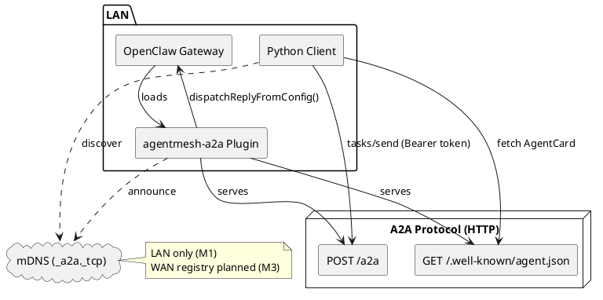
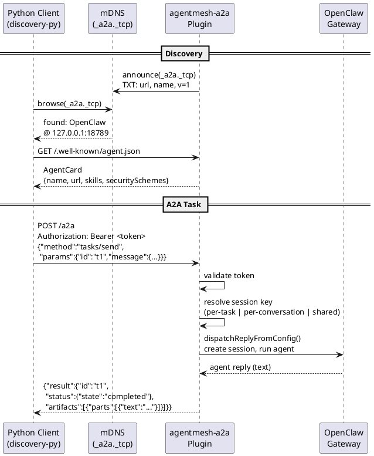

# AgentMesh

Agent discovery mesh for A2A agents. Enables agents across frameworks (OpenClaw, NanoClaw, etc.) to discover each other via mDNS and communicate using the [A2A protocol](https://google.github.io/A2A/).

## Features (M1)

- **LAN agent discovery** via mDNS (`_a2a._tcp`) — agents on the same network find each other automatically
- **Static discovery** via `bootstrap.json` for known agent endpoints
- **A2A protocol bridge for OpenClaw** — serves AgentCard, handles `tasks/send` and `tasks/get`
- **Bearer token authentication** for the A2A endpoint (auto-generated or explicit)
- **Session strategies**: `per-task`, `per-conversation`, `shared`
- **Python discovery SDK** (`agentmesh-discovery`) with mDNS, static, and merged discovery

**Not yet supported:**
- WAN / internet discovery (LAN only — no registry server yet)
- Streaming (`tasks/sendSubscribe`)
- Non-text message parts (images, files)
- Task cancellation (`tasks/cancel`)
- Multi-agent routing

## Architecture

### Component Overview



### Discovery + Task Flow



### Repository Structure

```
agentmesh/
├── packages/
│   ├── discovery-py/           # Python SDK — mDNS + static discovery
│   ├── openclaw-plugin/        # OpenClaw extension: AgentCard + A2A bridge + mDNS
│   ├── discovery-ts/           # TS SDK (planned)
│   ├── registry/               # Registry server (planned)
│   └── identity/               # Ed25519 identity (planned)
├── examples/
│   ├── py-agent/               # Discover → A2A task → print result
│   └── demo.sh
├── Makefile                    # Cross-language build commands
├── package.json                # Monorepo root (pnpm for TS)
├── pnpm-workspace.yaml
├── pyproject.toml              # Monorepo root (uv for Python)
└── README.md
```

## Quick Start

### Prerequisites

- [uv](https://docs.astral.sh/uv/) (Python package manager)
- [pnpm](https://pnpm.io/) (Node.js package manager)
- [OpenClaw](https://github.com/nichochar/openclaw) `>=2026.1.0 <2027.0.0`

### Install

```bash
cd agentmesh
make prepare          # Install all dependencies (pnpm + uv)
```

### Install the OpenClaw Plugin

```bash
make install-plugin
```

The CLI registers the plugin with an empty config. Add your config to
`~/.openclaw/openclaw.json` under `plugins.entries.agentmesh-a2a`:

```jsonc
{
  "plugins": {
    "entries": {
      // ... existing entries ...
      "agentmesh-a2a": {
        "enabled": true,
        "config": {
          "publicBaseUrl": "http://127.0.0.1:18789",
          "agentName": "OpenClaw",
          "auth": {
            "token": "your-secret-token"
          },
          "mdns": true,
          "session": {
            "strategy": "per-task"
          }
        }
      }
    }
  }
}
```

Verify the plugin loads:

```bash
openclaw plugins list
# Should show: AgentMesh A2A Bridge │ agentmesh-a2a │ loaded
```

To update the plugin after code changes:

```bash
make sync-plugin
# Then restart: openclaw gateway
```

### Plugin Config Reference

| Field | Type | Default | Description |
|---|---|---|---|
| `publicBaseUrl` | string | **(required)** | Public URL for this agent (no trailing slash) |
| `agentName` | string | `"OpenClaw"` | Agent name in the A2A AgentCard |
| `agentDescription` | string | `"An OpenClaw agent exposed via A2A"` | Description in the AgentCard |
| `mdns` | boolean | `true` | Announce agent via mDNS (`_a2a._tcp`) |
| `auth.token` | string | auto-generated | Bearer token for the `/a2a` endpoint |
| `auth.allowUnauthenticated` | boolean | `false` | Disable auth entirely (not recommended) |
| `session.strategy` | string | `"per-task"` | `"per-task"`, `"per-conversation"`, or `"shared"` |
| `session.prefix` | string | `"a2a"` | Session key prefix |
| `session.agentId` | string | `"main"` | Which OpenClaw agent identity to use |
| `session.timeoutMs` | number | `120000` | Max wait time (per-task only) |
| `skills` | array | `[{id:"chat",...}]` | Skills listed in the AgentCard |

### Run the Demo

```bash
# 1. Start OpenClaw gateway (plugin loads automatically)
openclaw gateway

# 2. Run the Python discovery demo (from agentmesh repo root)
AGENTMESH_TOKEN=your-secret-token uv run python examples/py-agent/main.py "What is 2+2?"
```

Example output:

```
Discovering A2A agents via mDNS...
Found agent: OpenClaw at http://127.0.0.1:18789/.well-known/agent.json
Fetching AgentCard from http://127.0.0.1:18789/.well-known/agent.json...
Agent: OpenClaw — An OpenClaw agent exposed via A2A
A2A endpoint: http://127.0.0.1:18789/a2a
Skills: Chat

Sending task: What is 2+2?
----------------------------------------
Status: completed

4
```

You can also skip mDNS discovery and target the agent directly:

```bash
AGENTMESH_TOKEN=your-secret-token uv run python examples/py-agent/main.py \
  --url http://127.0.0.1:18789/.well-known/agent.json "Hello!"
```

### Verify Manually

```bash
# AgentCard (public, no auth)
curl http://localhost:18789/.well-known/agent.json

# A2A task (requires auth)
curl -X POST http://localhost:18789/a2a \
  -H 'Content-Type: application/json' \
  -H 'Authorization: Bearer your-secret-token' \
  -d '{"jsonrpc":"2.0","id":"1","method":"tasks/send","params":{"id":"t1","message":{"role":"user","parts":[{"type":"text","text":"Hi"}]}}}'

# mDNS discovery (macOS)
dns-sd -B _a2a._tcp
```

## Packages

### `discovery-py` — Python Discovery SDK

```python
import asyncio
from agentmesh_discovery import MdnsDiscovery, DiscoveryManager

async def main():
    # Discover agents via mDNS
    discovery = MdnsDiscovery()
    agent = await discovery.discover_one(timeout=5.0)

    # Fetch AgentCard
    card = await DiscoveryManager.fetch_agent_card(agent.agent_card_url)
    print(card.name, card.url)

asyncio.run(main())
```

**Discovery sources:**
- `MdnsDiscovery` — listens for `_a2a._tcp.local.` via zeroconf
- `StaticDiscovery` — reads from a `bootstrap.json` file
- `DiscoveryManager` — merges and deduplicates across sources
- `MdnsAnnouncer` — publish your own agent via mDNS

### `openclaw-plugin` — OpenClaw A2A Bridge

Exposes any OpenClaw agent as a standard A2A agent:

- Serves `GET /.well-known/agent.json` (AgentCard)
- Accepts `POST /a2a` (A2A JSON-RPC: `tasks/send`, `tasks/get`)
- Announces via mDNS (`_a2a._tcp`)
- Token-based auth (auto-generated or explicit)
- Session strategies: `per-task`, `per-conversation`, `shared`

Each A2A task generates a unique session in OpenClaw. Sessions are visible in OpenClaw's session list (keyed as `agent:<agentId>:a2a:<agentId>:<taskId>`), though the conversation detail view does not currently render for the `a2a` provider.

#### Session strategy timeout behavior

| Strategy | `session.timeoutMs` | Effective timeout |
|---|---|---|
| `per-task` | Respected | Value from config (default 120s) |
| `per-conversation` | **Ignored** | Hardcoded 300s (5 min) ceiling |
| `shared` | **Ignored** | Hardcoded 300s (5 min) ceiling |

`per-conversation` and `shared` use a fixed 5-minute ceiling because late writes to shared sessions must remain consistent. `per-task` respects the configured `timeoutMs` because each task is isolated.

## Development

All commands run from the **repo root** (`agentmesh/`):

```bash
make prepare       # Install all dependencies (pnpm + uv)
make test          # Run all tests (TS + Python)
make check         # Lint + typecheck all
make format        # Format Python code
make help          # Show all available targets
```

Per-package targets are also available:

```bash
make test-openclaw-plugin    # TS plugin tests (56 tests)
make test-discovery-py       # Python SDK tests (15 tests)
make check-openclaw-plugin   # Typecheck TS plugin
make check-discovery-py      # Lint + typecheck Python SDK
```

## Known Limitations (M1)

- **Sync only**: Only `tasks/send` is supported. Streaming (`tasks/sendSubscribe`) is planned for M2.
- **Text-only**: Non-text message parts (images, files) are logged and skipped.
- **No cancellation**: `tasks/cancel` returns `-32601` (honest unsupported).
- **Session viewer**: OpenClaw's UI does not render conversation details for the `a2a` provider. Sessions appear in the list with correct token usage but the message transcript is not displayed.
- **Single agent**: All A2A tasks route to one agent identity (`session.agentId`). Multi-agent routing is planned for M2.

## Roadmap

### M2 — Streaming + Multi-agent

- `tasks/sendSubscribe` (SSE streaming responses)
- Multi-agent routing (route A2A tasks to different agent identities)
- Non-text message parts (images, files)
- Task cancellation (`tasks/cancel`)
- Adopt official [`a2a-sdk`](https://pypi.org/project/a2a-sdk/) for Python types + client (see [`docs/a2a-sdk_adoption.md`](docs/a2a-sdk_adoption.md))

### M3 — WAN Discovery + More Frameworks

- Registry server for WAN/internet discovery (beyond LAN mDNS)
- Ed25519 agent identity and mutual authentication
- TypeScript discovery SDK (`discovery-ts`)
- A2A bridge plugins for other frameworks (NanoClaw, etc.)

## Demo Flow

```
1. OpenClaw gateway starts with agentmesh-a2a plugin
   → Serves AgentCard at /.well-known/agent.json
   → Announces _a2a._tcp via mDNS
   → Listens for A2A tasks at POST /a2a

2. Python script runs
   → Discovers agent via mDNS (or uses --url to skip)
   → Fetches AgentCard
   → Sends A2A tasks/send with Bearer token
   → Prints the result
```
