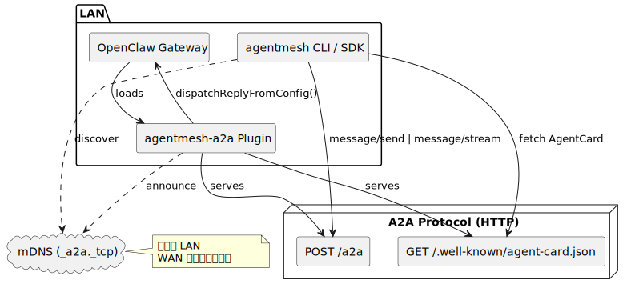
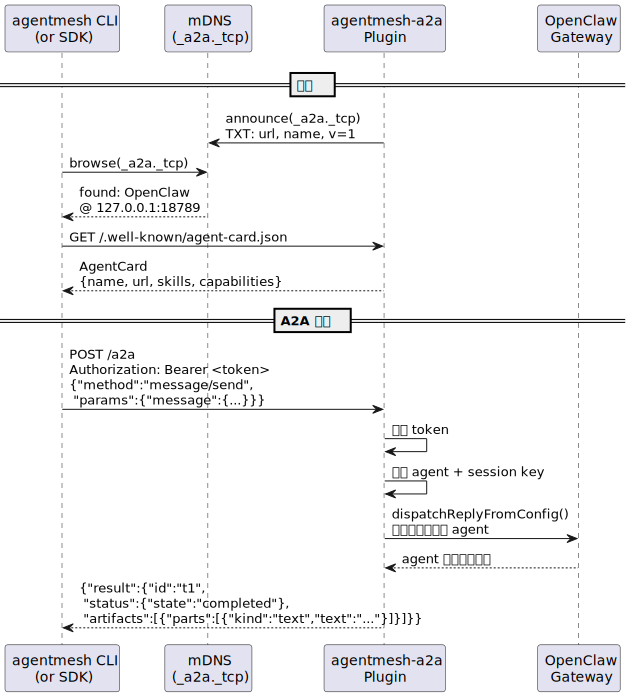

# AgentMesh

[English](./README.md) | [简体中文](./README.zh-CN.md)

AgentMesh 是一个面向 A2A Agent 的发现与互联层。它让不同框架（如 OpenClaw、NanoClaw）的 Agent 通过 mDNS 自动发现，并通过 [A2A 协议](https://google.github.io/A2A/)通信。

## 功能

| 功能 | 说明 | 包 |
|---|---|---|
| mDNS 发现 | 基于 `_a2a._tcp` 局域网自动发现 Agent | `discovery-py` (Python)、`openclaw-plugin` (TS) |
| 静态发现 | 通过 `bootstrap.json` 配置已知端点 | `discovery-py` (Python) |
| CLI 工具链 | `discover`、`run`、`trace` — 完整的 Agent 交互闭环 | `agentmesh-cli` (Python) |
| 控制面 | 事件存储（JSONL + SQLite）、HTTP API、daemon 管理 | `agentmeshd` (Python) |
| A2A 桥接 | AgentCard、`message/send`、`message/stream`、`tasks/get`、`tasks/cancel` | `openclaw-plugin` (TS) |
| SSE 流式响应 | 实时推送文本、工具状态、推理元数据 | `openclaw-plugin` (TS) |
| 多 Agent 路由 | 根据 `skill_id` 路由到不同 Agent identity | `openclaw-plugin` (TS) |
| Token 鉴权 | 自动生成或显式配置；CLI 自动从配置读取 | `openclaw-plugin` (TS)、`agentmesh-cli` (Python) |
| 会话策略 | `per-task`、`per-conversation`、`shared` | `openclaw-plugin` (TS) |
| 对齐 A2A v0.3 | `kind`、`context_id`、`message_id`、9 状态生命周期 | 全部 |

**尚未支持：** WAN / 互联网发现（当前仅限局域网）

## 快速开始

### 前置要求

- [uv](https://docs.astral.sh/uv/)（Python 包管理器）
- [pnpm](https://pnpm.io/)（Node.js 包管理器）
- [OpenClaw](https://github.com/nichochar/openclaw) `>=2026.1.0 <2027.0.0`

### 安装

```bash
cd agentmesh
make prepare          # 安装所有依赖 + CLI 工具
```

安装完成后可使用两个命令行工具：`agentmeshd`（daemon）和 `agentmesh`（客户端）。

### 配置 OpenClaw Agent

安装 A2A 桥接插件：

```bash
agentmesh openclaw install
```

在 `~/.openclaw/openclaw.json` 中配置：

```jsonc
{
  "plugins": {
    "entries": {
      // ... 已有条目 ...
      "agentmesh-a2a": {
        "enabled": true,
        "config": {
          "publicBaseUrl": "http://127.0.0.1:18789",
          "agentName": "OpenClaw",
          "auth": { "token": "your-secret-token" },
          "mdns": true,
          "session": { "strategy": "per-task" }
        }
      }
    }
  }
}
```

启动 OpenClaw gateway：

```bash
openclaw gateway
```

### 发现、调用、追踪

```bash
# 1. 后台启动 daemon（用于记录事件，trace 依赖）
agentmeshd start -b

# 2. 发现局域网 Agent
agentmesh discover

# 3. 向 Agent 发送消息
agentmesh run --agent OpenClaw "1+1 等于多少？"

# 4. 查看事件轨迹
agentmesh trace <run-id>

# 5. 停止 daemon
agentmeshd stop
```

CLI 会自动从 OpenClaw 配置中读取鉴权 token。也可以手动指定：

```bash
agentmesh run --agent OpenClaw --token your-secret-token "你好"
```

## CLI 参考

### `agentmesh discover`

扫描局域网 A2A Agent（mDNS），可合并静态引导文件。

```bash
agentmesh discover                           # 默认 5 秒超时，表格输出
agentmesh discover --timeout 10              # 延长扫描时间
agentmesh discover --bootstrap agents.json   # 合并静态条目
agentmesh discover --format json             # JSON 输出
```

退出码：`0`（发现 Agent）、`11`（未发现）。

### `agentmesh run`

向 A2A Agent 发送消息，事件自动记录到 `agentmeshd` 供后续追踪。

```bash
# 通过 Agent 名称（mDNS 解析）
agentmesh run --agent OpenClaw "你好"

# 通过 AgentCard URL
agentmesh run --agent http://127.0.0.1:18789/.well-known/agent-card.json "你好"

# 指定鉴权 token
agentmesh run --agent OpenClaw --token my-secret "你好"

# 跳过 daemon（不记录事件）
agentmesh run --agent OpenClaw --no-daemon "你好"
```

| 选项 | 说明 |
|---|---|
| `--agent` / `--to` | Agent 名称或 AgentCard URL |
| `--from` | 发送方身份（仅记录到 metadata） |
| `--token` | Bearer Token（也读取 `AGENTMESH_TOKEN` 环境变量） |
| `--timeout` | A2A 调用超时秒数（默认 120） |
| `--no-stream` | 禁用流式输出 |
| `--no-daemon` | 跳过 daemon 检查，不记录事件 |
| `--daemon-url` | 自定义 agentmeshd 地址 |
| `--format` | `streaming`（默认）或 `json` |

退出码：`0`（成功）、`10`（daemon 不可用）、`11`（Agent 未找到）、`12`（调用失败）。

### `agentmesh trace`

回放某次调用的事件时间线，需要 `agentmeshd` 运行中。

```bash
agentmesh trace <run-id>                     # 时间线输出
agentmesh trace <task-id>                    # 也接受 task ID
agentmesh trace <run-id> --format json       # JSON 输出
```

示例输出：

```
Run: abc-123  Agent: OpenClaw  Started: 2026-02-19T10:00:00Z

10:00:00.000  message   "1+1 等于多少？"
10:00:00.120  status    working
10:00:01.100  status    completed
10:00:01.100  artifact  "2"

Duration: 1.1s  Events: 4
```

退出码：`0`（成功）、`1`（无事件）、`10`（daemon 不可用）。

### `agentmesh openclaw install`

安装 OpenClaw A2A 桥接插件，需要 `openclaw` CLI。

```bash
agentmesh openclaw install           # 安装插件
agentmesh openclaw install --force   # 重新安装 / 更新
```

## OpenClaw 插件配置

| 字段 | 类型 | 默认值 | 说明 |
|---|---|---|---|
| `publicBaseUrl` | string | 必填 | 该 Agent 对外访问地址（不要带尾斜杠） |
| `agentName` | string | `"OpenClaw"` | AgentCard 名称 |
| `agentDescription` | string | `"An OpenClaw agent exposed via A2A"` | AgentCard 描述 |
| `mdns` | boolean | `true` | 是否通过 mDNS 广播 |
| `auth.token` | string | 自动生成 | `/a2a` 的 Bearer Token |
| `auth.allowUnauthenticated` | boolean | `false` | 是否关闭鉴权（不推荐） |
| `session.strategy` | string | `"per-task"` | `per-task` / `per-conversation` / `shared` |
| `session.prefix` | string | `"a2a"` | 会话 key 前缀 |
| `session.agentId` | string | `"main"` | 默认使用的 OpenClaw identity |
| `session.timeoutMs` | number | `120000` | 最长等待时间（仅 `per-task` 生效） |
| `skills` | array | `[{id:"chat",...}]` | AgentCard 技能（单 Agent） |
| `agents` | object | — | 多 Agent 技能路由配置 |

代码改动后同步插件：

```bash
make sync-plugin      # rsync src/ 到扩展目录
# 然后重启 openclaw gateway
```

## Python SDK

`agentmesh-discovery` 包提供编程方式的 Agent 发现能力：

```python
import asyncio
from agentmesh_discovery import MdnsDiscovery, DiscoveryManager

async def main():
    discovery = MdnsDiscovery()
    agent = await discovery.discover_one(timeout=5.0)

    card = await DiscoveryManager.fetch_agent_card(agent.agent_card_url)
    print(card.name, card.url)

asyncio.run(main())
```

**发现源：**
- `MdnsDiscovery` — 监听 `_a2a._tcp.local.`（zeroconf）
- `StaticDiscovery` — 读取 `bootstrap.json`
- `DiscoveryManager` — 多来源合并去重
- `MdnsAnnouncer` — 广播本地 Agent

完整示例（发现 + 通过 `a2a-sdk` 调用）见 `examples/py-agent/main.py`：

```bash
uv run python examples/py-agent/main.py "1+9"
```

## 架构

### 组件概览



图源：`docs/diagrams/component-overview.zh-CN.puml`

### 发现 + 调用流程



图源：`docs/diagrams/discovery-invoke-flow.zh-CN.puml`

### 仓库结构

```
agentmesh/
├── packages/
│   ├── agentmesh-cli/          # CLI：发现、调用、追踪 A2A Agent
│   ├── agentmeshd/             # 控制面 daemon：事件存储、HTTP API
│   ├── discovery-py/           # Python SDK：mDNS + 静态发现
│   └── openclaw-plugin/        # OpenClaw 插件：AgentCard + A2A 桥接 + mDNS
├── docs/diagrams/              # README 使用的 PlantUML 源文件与生成 SVG
├── scripts/                    # 发布/CI 辅助脚本
├── tests/e2e/                  # E2E 烟测
├── examples/py-agent/          # SDK 使用示例
├── Makefile                    # 跨语言构建命令
├── pyproject.toml              # Python monorepo 根配置（uv）
└── package.json                # TS monorepo 根配置（pnpm）
```

## 开发

所有命令在仓库根目录执行：

```bash
make prepare       # 安装所有依赖 + CLI 工具
make test          # 运行全部测试（TS + Python）
make check         # Lint + 类型检查
make format        # 格式化 Python 代码
make render-diagrams # 将 docs/diagrams/*.puml 编译为 SVG
make check-diagrams  # 校验 SVG 是否与源码同步
make release-check # 校验发布版本一致性（可选：RELEASE_TAG=vX.Y.Z）
make build         # 构建 Python 与 npm 发布产物到 dist/
make help          # 查看所有可用目标
```

按包执行：

```bash
make test-openclaw-plugin    # TS 插件测试
make test-discovery-py       # Python SDK 测试
make test-agentmeshd         # agentmeshd 测试
make test-agentmesh-cli      # CLI 单元测试
make test-e2e                # E2E 烟测
```

### 底层 A2A 验证

```bash
# 获取 AgentCard（无需鉴权）
curl http://localhost:18789/.well-known/agent-card.json

# 发送消息（需要 token）
curl -X POST http://localhost:18789/a2a \
  -H 'Content-Type: application/json' \
  -H 'Authorization: Bearer your-secret-token' \
  -d '{"jsonrpc":"2.0","id":"1","method":"message/send","params":{"id":"t1","message":{"role":"user","parts":[{"kind":"text","text":"Hi"}]}}}'

# macOS 查看 mDNS 服务
dns-sd -B _a2a._tcp
```

## 已知限制

- **取消是 best-effort** — OpenClaw 没有硬中断 `dispatchReplyFromConfig` 的 API，A2A 任务标记取消但内部 dispatch 可能继续执行
- **非文本消息会转文本** — `file`/`data` 会转为 `[File: ...]`、`[Data: ...]` 文本表示
- **流式粒度依赖 OpenClaw** — 若仅返回 `final`，则退化为单次 SSE 事件
- **仅限局域网** — 暂无 WAN / 互联网发现

## 路线图

| 方向 | 说明 |
|---|---|
| Web GUI | 拓扑可视化、事件时间线、筛选过滤 |
| Agent Teams | FSM 编排器、多 Agent 协作模板 |
| WAN 发现 | Tailscale 接入、注册中心 |

详见[执行计划](docs/m1-m4_execution_plan.md)。
